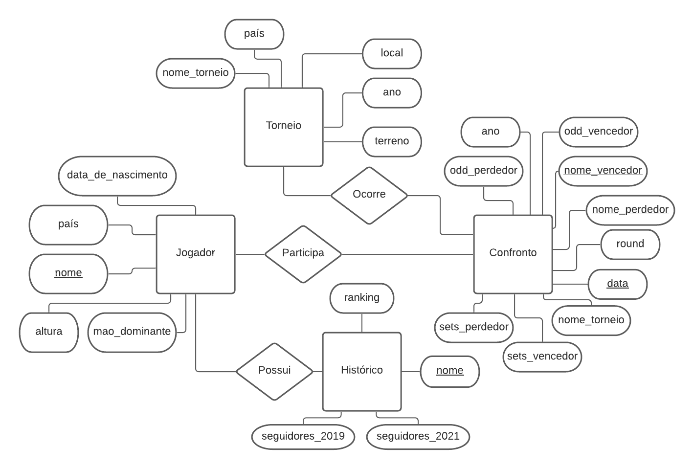
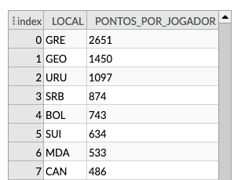
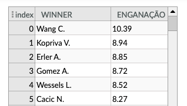
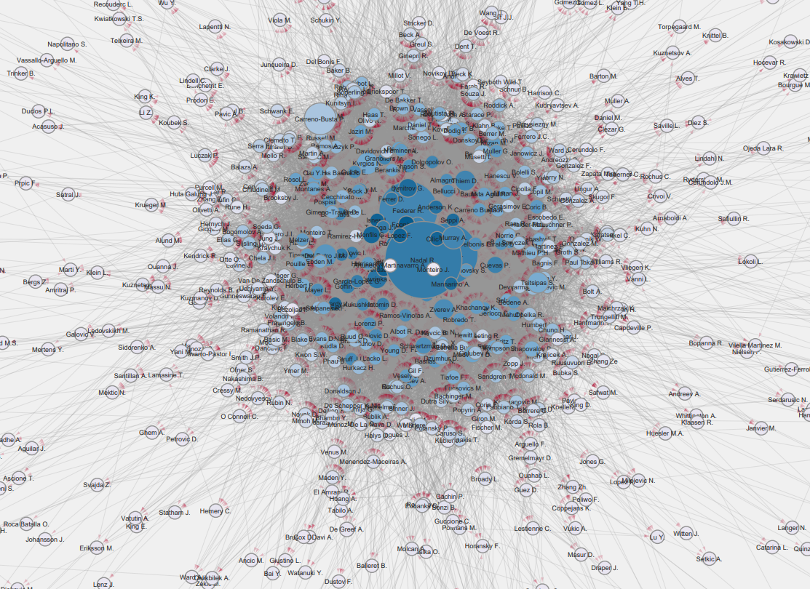
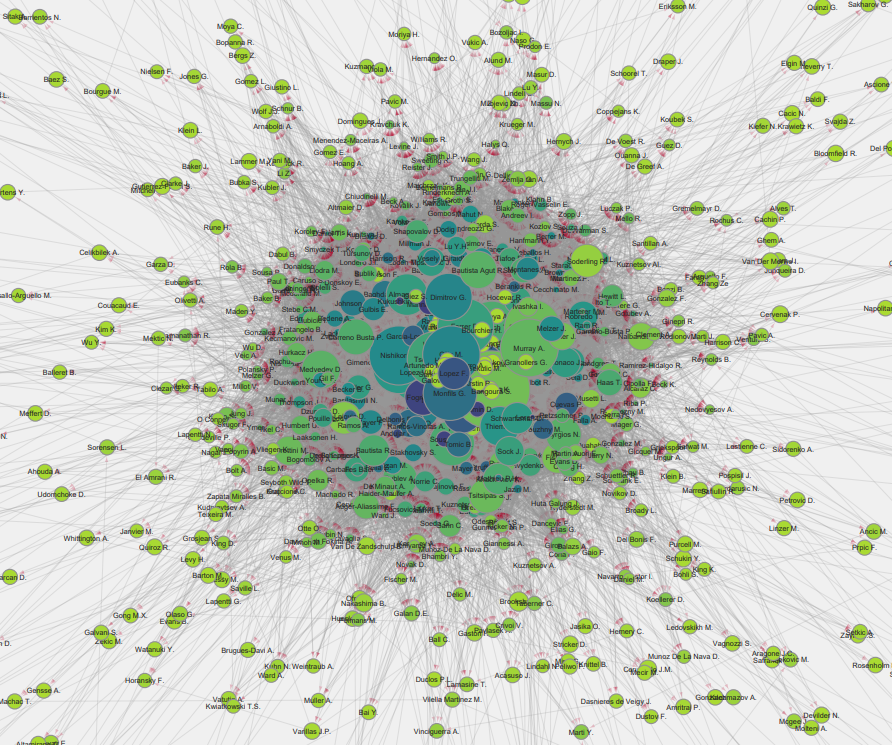

# Projeto TennisBets

# Equipe VGAHDM - VGA
* Artur Abreu Hendler - 231713
* Guilherme Zeferino Rodrigues Dobins - 236129
* João Vitor Baptista Moreira - 237833

## Resumo do Projeto
 O projeto consiste em uma análise de dados referente a apostas esportivas em confrontos de tênis e como fatores intrínsecos a um jogador e a esperança que os apostadores depositam nele podem influenciar no resultado final. Os dados serão coletados a partir de tabelas disponíveis em sites de históricos esportivos. Alguns desses sites não possuem arquivos com os dados prontos. Dessa maneira, pretendemos realizar a obtenção dos dados com um web crawler, de modo que possamos construir nossas próprias tabelas com os dados que nos interessem. A princípio, construiremos 4 modelos relacionais, que contém dados dos jogadores, dos torneios, dos confrontos e dos históricos de jogos.

## Slides da Apresentação
 [Slides](slides/slidefinal.pdf)

## Modelo Conceitual
- Relacional
    
##### Nota:  O atributo ranking da componente histórico representa a pontuacao do jogador de 2010 até 2020 como indicado no modelo lógico. Ela foi simplificada aqui para não poluir a imagem.

## Modelos Lógicos

- Relacional:   
~~~
Jogador(_nome_, pais, data_de_nascimento, altura, mao_dominante)
Torneio(_nome_torneio_,_ano_,local, pais, terreno)
Historico(_nome_, seguidores_2019, seguidores_2021, ranking_2010,ranking_2011,...,ranking_2021)
  nome chave estrangeira -> Jogador(nome)
Confronto(_nome_vencedor_, _nome_perdedor_,_data_,odd_vencedor,odd_perdedor,round,nome_torneiro, ano,sets_vencedor,sets_perdedor)  
  nome_vencedor chave estrangeira -> Jogador(nome)
  nome_perdedor chave estrangeira -> Jogador(nome)
  nome_torneio chave estrangeira -> Torneio(nome_torneio)
~~~
- Grafo:   

- Modelo de grafos de propriedades:
[!modeloGrafo](assets/modeloGrafo.png) 

## Dataset Publicado

título do arquivo/base | link | breve descrição
----- | ----- | -----
Confrontations | [confrontations.csv](data/processed/confrontations.csv) | Corresponde ao componente "confrontos" do modelo conceitual 
History | [history.csv](data/processed/history.csv) | Corresponde ao componente "histórico" do modelo conceitual
Players | [players.csv](data/processed/players.csv) | corresponde ao componente "Jogador" do modelo conceitual
Tournaments | [tournaments.csv](data/processed/tournaments.csv) | corresponde ao componente "Torneio" do modelo conceitual
Banco de dados de Grafos | [graph_relations.csv](data/processed/graph_relations.csv) | Arquivo usado para gerar as arestas e nós do banco de dados de grafos

> Este é o conjunto mínimo de informações que deve constar na disponibilização do Dataset, mas a equipe pode enriquecer esta seção.

## Bases de Dados

título da base | link | breve descrição
----- | ----- | -----
Men Instagram pages | [Instagram](https://instagram.com) | Arquivos HTML referente as páginas no Instagram dos jogadores (multiple HTMLs).
Women Instagram pages| [Instagram](https://instagram.com)  | Arquivos HTML referente as páginas no Instagram das jogadoras (multiple HTMLs).
Tennis Data UK | [tennis-data.co.uk](http://www.tennis-data.co.uk/) | Registros de jogos de homens e mulheres incluindo o resultado, as *odds*, local e outros dados sobre as partidas. Estão agrupados por ano e sexo (multiple CSVs).
Functional Tennis: Top 100 Instagram Tennis Players| [functionaltennis](https://www.functionaltennis.com/blogs/news/atp-wta-top-100-instagram-rankings) | Link para as páginas do Instagram dos jogadores e jogadoras assim como seu número de seguidores no momento da postagem (fev/2019) (CSV).
JeffSackmann - tennis_atp | [github/tennis_atp](https://github.com/JeffSackmann/tennis_atp) | Dados sobre jogadores como data de nascimento, nacionalidade, mão dominante e altura.
JeffSackmann - tennis_wta | [github/tennis_wta](https://github.com/JeffSackmann/tennis_wta) | Dados sobre jogadoras como data de nascimento, nacionalidade, mão dominante e altura.
World Cities | [kaggle/worldcities](https://www.kaggle.com/viswanathanc/world-cities-datasets) | Dataset contendo dados sobre cidades como o país a qual ela pertence e a sigla de três dígitos ISO desse país.


## Detalhamento do Projeto
Com o objetivo de criar um banco de dados que relacionasse diferentes propriedades, nossa equipe decidiu que o primeiro passo do projeto deveria ser a obtenção dos dados. Parte desses dados foi obtida a partir de arquivos csv disponibilizados pelas fontes citadas anteriormente, no entanto alguns dados exigiram uma extração mais elaborada, como foi o caso da obtenção do número de seguidores no instagram de certos jogadores. A primeira tarefa dessa obtenção foi obter os endereços do instagram dos jogadores, o que foi obtido um arquivo csv. Com esses dados, foi gerado um [script em python](src/extraction/getHTMLs.py) que envia um request para o instagram, e o site retorna um arquivo HTML com diversas informações sobre a página. Esse código pode ser visto abaixo:
~~~python
accounts_men = open("../../data/raw/menInstagram2019.csv", newline='\n', encoding= 'utf-8')
num_lines_men = sum(1 for _ in accounts_men)
...
for _ in range(num_lines_men - 1):
	item = accounts_men.readline().replace('\x00','').split(',')
	# if the file already exists, it does not request it again
	if(not exists("../../data/raw/menInstagramHTMLs/"+item[0]+".html")):
		try:	
			urllib.request.urlretrieve(item[-1], "../../data/raw/menInstagramHTMLs/"+item[0]+".html")
		except:
			print("request failed")
		#sleep(61) #avoids getting blocked by Instagram - might be better off without it
~~~
E a partir desse HTML, foi feito [outro script](src/aggregation/scrapFollowers.py) que extrai apenas o número de seguidores e guardava em um arquivo intermediário, e com isso foi finalizada a extração dos dados. 

Após isso, para que pudéssemos usar tais dados, foi preciso realizar certas transformações de modo a permitir que informações de diferentes fontes pudessem ser usados em conjunto, evitando, por exemplo, que jogadores aparecessem com nomes diferentes dependendo da fonte, ou evitando que dados de diferentes fontes fossem conflitantes. Para resolver esse problema, criamos programas que [uniam dados sobre os torneios de tenis de diferentes fontes](src/aggregation/getTournaments.py), [faziam um match entre nomes de jogadores](src/treatment/MenNameMatching.py) que estavam diferentes dependendo da fonte dos dados, e outros tratamentos. Nesse processo, foram necessárias muitas transformações dos dados, e, para evitar perder muito tempo, decidimos iniciar a construção dos bancos de dados nesse ponto e adicionar mais informações conforme o processo de tratamento dos dados era concluído. Como o banco de dados relacional exigia uma coerência entre diversas tabelas, visto que a maioria delas fazia uso de chaves estrangeiras, não foi possível implementar tal banco antes de terminar as operações pendentes, com isso passamos para a implementação do banco de dados de grafos.

O banco de dados foi criado utilizando o software Neo4j. Nele, foram carregadas as informações dos jogadores, que atuaram como nós, e informações dos confrontos, que deram origem às arestas do grafo. Essas arestas possuíam a propriedade "times", que guarda a quantidade de vezes que um jogador venceu outro. Essa informação foi gerada com um [script simples](src/aggregation/matchups_count.py) que utilizava a tabela confrontos para gerar essa nova informação, e isso foi posteriormente utilizado na análise dos grafos. Com o banco de dados criado no Neo4j, foi possível realizar análises acerca da rede, como a centralidade dos nós (utilizando o algoritmo de pagerank), as comunidades a qual os nós pertencem, e outras informações. Os dados gerados através das análises do Neo4j, assim como o grafo, foram então exportados para o software Cytoscape, onde foi possível analisar profundamente o banco de dados e responder à perguntas propostas no início do projeto. O processo de criação e análises utilizando os grafos pode ser visto na [documentação](src/graphs/analise_grafo.md).

Ao fim da criação do banco de dados de grafos, o processo de tratamento dos dados havia sido concluído, e então utilizamos SQL para gerar o banco de dados relacional, que seguiu o modelo lógico descrito anteriormente. Assim como no caso dos grafos, após o banco de dados ser criado, passamos para a implementação de queries que nos permitiram responder à perguntas propostas no início do projeto.

## Evolução do Projeto


Primeiramente, começamos a extrair os dados necessários para o dataset por meio de diferentes fontes. Algumas delas já disponibilizavam as informações por meios de arquivos csv, o que facilitou o processo. Entretanto, para extrair o número de seguidores dos jogadores no instagram, foi necessário realizar diversos requests para a plataforma e construir um script para selecionar apenas as informações que queríamos da página de cada jogador. Como as APIs que facilitam esse processo são pagas, o modo que utilizamos se mostrou muito lento e ineficiente caso fosse aplicado a um grande volume de dados. 

Uma outra grande dificuldade que encontramos foi que, apesar das fontes apresentarem dados bastante completos e úteis para a análise, a falta de uma padronização entre as diversas fontes foi algo que gerou um grande conflito ao relacionar as tabelas. Alguns jogadores possuíam diferentes nomes em cada fonte. Por exemplo, o jogador Rafael Nadal possuía seu nome escrito como 'R. Nadal' em uma das fontes e 'Rafael Nadal' em outra. Dessa maneira, foi preciso construir um script que padronizasse o formato do nome de cada jogador. Entretanto, isso gerou outro problema, que foi o caso em que mais de um jogador possuía o mesmo nome abreviado que outro. Dessa maneira, as nossas análises entendiam que dois ou mais jogadores diferentes se tratavam do mesmo jogador.

Para resolver esse problema, testamos algumas possibilidades que poderiam ser adicionadas como chave primária do jogador além de seu nome. A chave que se mostrou mais eficiente foi com nome e data de nascimento. Por outro lado, isso gerou outro conflito, que alguns dados da data de nascimento de alguns jogadores estavam faltando. Para corrigir isso, completamos dados faltantes com datas arbitrárias, em casos em que não era interessante excluir o jogador. Mas, na maior parte das vezes, notamos que os jogadores que possuíam dados faltantes eram em geral jogadores de menores expressão e que possuíam poucas partidas catalogadas. Por esse motivo, optamos por excluir tais jogadores do nosso dataset.

Uma outra mudança que decidimos fazer ao longo do projeto foi com relação ao ranking. Inicialmente, tínhamos coletado os dados que eram atualizados a cada campeonato, ou seja, várias vezes ao mês. No final optamos por manter apenas o ranking final de cada ano, pois isso nos daria uma visão melhor da temporada dos jogadores, visto que muitos deles possuem calendários distintos conforme os países em que jogam. Ainda sobre o ranking, realizamos uma mudança na ideia inicial, que era analisar tanto o masculino quanto o feminino. Como se tratam de categorias diferentes e disputam campeonatos distintos, concluímos que faria mais sentido realizar análises separadamente.

Em geral, conseguimos lidar bem com todas as dificuldades que encontramos, de modo que o dataset nos forneceu informações interessantes sobre o esporte. Além disso, o dataset pode ser constantemente atualizado para o futuro, visto que a cada ano são realizados novos campeonatos e as apostas online têm crescido bastante nos últimos anos, o que gera cada vez mais dados relevantes para o nosso estudo.

## Perguntas de Pesquisa/Análise Combinadas e Respectivas Análises

> Apresente os resultados da forma mais rica possível, com gráficos e tabelas. Mesmo que o seu código rode online em um notebook, copie para esta parte a figura estática. A referência a código e links para execução online pode ser feita aqui ou na seção de detalhamento do projeto (o que for mais pertinente).

> Liste aqui as perguntas de pesquisa/análise e respectivas análises. Nem todas as perguntas precisam de queries que as implementam. É possível haver perguntas em que a solução é apenas descrita para demonstrar o potencial da base. Abaixo são ilustradas três perguntas, mas pode ser um número maior a critério da equipe.

### Perguntas/Análise com Resposta Implementada


#### Pergunta/Análise 1
> * QUAIS JOGADORES TIVERAM AS MELHORES PERFORMANCES INDIVIDUAIS EM UMA TEMPORADA NOS ÚLTIMOS 10 ANOS?
>   
>   * A cada ano novos jogadores tentam atingir a elite e se tornar o número 1 do ranking. Entretanto, alguns jogadores conseguem ser os melhores em várias temporadas, como podemos ver a seguir.

```
SELECT *
FROM Historico
WHERE ano_2010 =  (SELECT MAX(ano_2010) FROM Historico) OR
ano_2011 =  (SELECT MAX(ano_2011) FROM Historico) OR
ano_2012 =  (SELECT MAX(ano_2012) FROM Historico) OR
ano_2013 =  (SELECT MAX(ano_2013) FROM Historico) OR
ano_2014 =  (SELECT MAX(ano_2014) FROM Historico) OR
ano_2015 =  (SELECT MAX(ano_2015) FROM Historico) OR
ano_2016 =  (SELECT MAX(ano_2016) FROM Historico) OR
ano_2017 =  (SELECT MAX(ano_2017) FROM Historico) OR
ano_2018 =  (SELECT MAX(ano_2018) FROM Historico) OR
ano_2019 =  (SELECT MAX(ano_2019) FROM Historico) OR
ano_2020 =  (SELECT MAX(ano_2020) FROM Historico) 
```


#### Pergunta/Análise 2
> * QUAIS PAÍSES POSSUEM MAIS PONTOS POR JOGADOR NO RANKING EM 2019?
>   
>   * O incentivo ao esporte em diferentes países pode levar com que vários jogadores consigam ter sucesso na profissão de tenista. Dessa maneira, podemos analisar quais países possuem a maior média de pontos em seus jogadores profissionais, como visto na query abaixo.

```DROP VIEW IF EXISTS Ranking_per_country;
CREATE VIEW Ranking_per_country AS
SELECT nome, ano_2019, local
FROM Jogador, Historico
WHERE nome = name

DROP VIEW IF EXISTS Ranking_per_capita;
CREATE VIEW Ranking_per_capita as
SELECT LOCAL, SUM(ANO_2019) total, Count(local) num
FROM Ranking_per_country
GROUP BY LOCAL
ORDER BY total desc

SELECT local, total/num as pontos_por_jogador
from Ranking_per_capita
ORDER BY pontos_por_jogador desc
```

#### Pergunta/Análise 3
> * Quais foram os maiores enganadores nas partidas?
>   
>   * Analisando o dataset, vemos que muitos jogos em que as apostas a favor de um jogador são grandes e ele perde sua partida, assim como grandes apostas contra um jogador e ele consegue se superar e vencer o jogo. Pensando nisso, podemos analisar quais os jogadores mais subestimados e quais os mais superestimados.

```
DROP VIEW IF EXISTS WSUBESTIMADO;
CREATE VIEW WSUBESTIMADO AS
SELECT winner, AVG(oddwinner) odd_media, Count(winner) vitorias
FROM CONFRONTO
GROUP BY WINNER
ORDER BY odd_media desc

DROP VIEW IF EXISTS LSUBESTIMADO;
CREATE VIEW LSUBESTIMADO AS
SELECT loser, AVG(oddloser) odd_media, Count(loser) derrotas
FROM CONFRONTO
GROUP BY LOSER
ORDER BY odd_media desc

SELECT winner, (wsubestimado.odd_media * (VITORIAS/DERROTAS)) as enganação
FROM LSUBESTIMADO, WSUBESTIMADO
WHERE WINNER = LOSER
ORDER BY ENGANAÇÃO DESC

```


#### Pergunta/Análise 4
> * Existe uma relação direta entre o número de partidas jogadas por um jogador e sua popularidade?
>   
>   * Utilizando as informações de popularidade e os graus de entrada e saída de certo nó do grafo, foi possível associar o tamanho de cada nó com o número de seguidores que ele possui, e sua cor à quantidade de partidas realizadas por esse jogador. Com isso, é possível notar um padrão entre o tamanho de um nó e sua cor, isto é, seus seguidores e o número de partidas jogadas?

[Pdf com imagem em alta resolução](assets/grafo_popularidade_partida.pdf)

Observando a imagem, vemos que, de fato, os maiores nós são mais escuros que a maioria dos demais, no entanto, vemos que alguns jogadores, como Lopes F., jogaram mais partidas que Nadal ou Federer, mas sua popularidade não se compara às deles. Sendo assim, não é possível afirmar que a quantidade de partidas jogadas é o suficiente para tornar um jogador popular. Apesar disso, é interessante observar que jogadores com poucos jogos tem, no geral, uma popularidade muito baixa se comparados aos mais experientes. 

#### Pergunta/Análise 5
> * Como podemos relacionar as interações dos jogadores com seu saldo de vitórias?
>   
>   * O banco de dados de grafos permitiu calcular o saldo de vitórias dos jogadores através de seus graus de entrada e saída. Nesse grafo, as arestas tem seu peso determinado pela quantidade de vezes que um jogador derrotou outro, fazendo com que rivais apareçam mais próximos no grafo. Somado a isso, utilizando o Neo4j, podemos calcular o pagerank de cada jogador. Com essas informações, associando o saldo de vitórias ao tamanho dos nós e a centralidade ao tom da cor, podemos observar alguma associação entre esses atributos?

[Pdf com imagem em alta resolução](assets/grafo_saldo_vitorias_pagerank.pdf)

Observando esse grafo, vemos que os jogadores com maior saldo de vitórias não possuem um valor de centralidade acima dos demais, na verdade alguns possuem uma centralidade baixa, enquanto que a maioria dos jogadores com alta centralidade são os que possuem um saldo de vitórias mediano. Essa informação tem sentido no mundo real, visto que os jogadores mais habilidosos tendem a se enfrentar regularmente, e não realizam muitos confrontos com jogadores menos experientes, tornando-os mais isolados na rede. Já os jogadores intermediários enfrentam tanto jogadores menos experientes quanto jogadores no topo, sendo assim, essas pessoas criam um caminho entre novatos e profissionais bem estabelecidos, explicando a relação entre a centralidade e sua taxa de vitórias.


### Perguntas/Análise Propostas mas Não Implementadas

#### Pergunta/Análise 1
> * Observando as primeiras relações criadas por um jogador, é possível determinar se este é um profissional promissor?
>   
>   * Com o uso do banco de dados de grafo, é possível analisar as primeiras relações criadas por certos jogadores em torneios profissionais. Dito isso, podemos inferir que um jogador que inicia sua carreira enfrentando os jogadores mais habilidosos tende a ser mais promissor? Ou ainda, podemos dizer que um jogador que já participou de um alto número de partidas, mas nunca enfrentou um dos melhores, é um jogador com menos potencial?

#### Pergunta/Análise 2
> * Como a idade de um jogador influencia na sua performance do torneio?
>   
>   * É interessante observar se o desempenho de um jogador é afetado positiva ou negativamente conforme ele vai ganhando experiência em diferentes campeonatos ao longo de sua carreira. 

#### Pergunta/Análise 3
> * Como os análises feitas anteriormente se diferenciam das jogadoras?
>   
>   * Podemos observar a relação que existe entre as análises da categoria masculina e feminina, de modo a entender se comunidades diferentes de um mesmo esporte possuem comportamentos semelhantes no final.

> as queries podem ser encontradas em [notebook SQL](notebooks/queries.ipynb) e as instruções para a criação do grafo podem ser encontradas em [grafos](src/graphs/)
